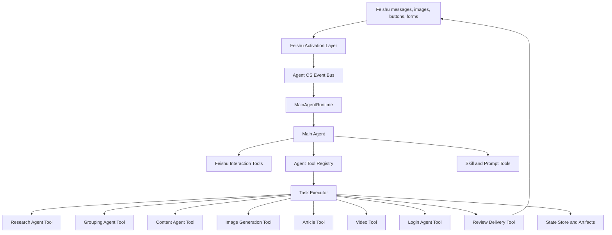

# Feishu Event-Driven Agent OS Design

## Summary

Rewrite the current Feishu-first entrypoint into an event-driven Agent OS. The
main Agent becomes a long-running planner and organizer that receives user
messages at any time, understands intent, turns requirements into runtime
parameters, and calls specialist Agents as tools. Existing specialist Agents are
preserved as atomic capabilities, but the fixed `route -> pipeline` control flow
is replaced.

This design follows the local PI runtime pattern: a long-lived Agent owns the
conversation state, external messages can be queued into the run, control events
can reset or interrupt the session, and tools stay separate from UI transport.
The Pydantic AI source already supports the needed queue model through
`AgentRun.enqueue` / `RunContext.enqueue`, so the Python implementation should
build on that instead of inventing a parallel message loop.

## Current Problem

The current implementation has useful parts, but the top-level behavior is still
too static:

- `FeishuWorkflowService` parses a Feishu message into one `ConversationRequest`,
  plans one route, then executes one route orchestrator.
- `FeishuContentOrchestrator` is effectively a route dispatcher over
  image/article/video runners.
- Live user input currently cancels and restarts the route run instead of being
  a natural message inserted into a long-lived main Agent session.
- User requirements such as image count, visual style, reference images, model
  choices, research depth, concurrency, and review strictness are not represented
  as a first-class runtime call spec owned by the main Agent.

The result feels like a configurable pipeline, not an autonomous task organizer.

## Target Principles

- The main Agent is independent from concrete work Agents. It plans, asks,
  organizes, delegates, observes results, and decides the next step.
- Every specialist Agent remains atomic and owns one task area: research,
  grouping, content drafting, image generation, video download, cover generation,
  login/access, review, or delivery.
- User configuration is runtime input. Defaults can come from config files, but
  the main Agent must translate user intent into explicit tool parameters before
  starting specialist work.
- Feishu interaction is only a translation layer. The main Agent calls tools such
  as `ask_single_choice` or `send_delivery`; those tools render Feishu cards,
  forms, files, and images.
- Skills and prompt templates are first-class resources selected by Agents based
  on meaning, not keyword triggers.
- Cross-Agent data uses `ResultEnvelope` and artifact references. Paths are only
  fields inside envelopes, never a second protocol.
- Direct Xiaohongshu publishing stays out of the formal workflow.

## Architecture



### MainAgentRuntime

`MainAgentRuntime` is the long-running session owner. It wraps a Pydantic AI
Agent run and exposes operations equivalent to the PI runtime:

- `start_session()`: create or resume the main conversation.
- `enqueue_user_text(text, priority)`: insert Feishu text as a normal user
  message.
- `enqueue_user_image(path, caption, priority)`: insert a user image message.
- `enqueue_control(action)`: handle `new_session`, `interrupt`, and `follow_up`.
- `wait_for_idle()`: wait until the Agent has no pending tool work.
- `reset_session()`: drop current main Agent history and pending events.

Priority semantics:

- `asap`: inject at the next safe Agent turn, after the current tool batch or
  model turn finishes.
- `when_idle`: queue until the current task would otherwise stop.
- `interrupt`: cancel the current task executor run, then inject the new request.
- `new_session`: cancel current work, clear pending events, reset main Agent
  history, and start a fresh conversation.

### Feishu Activation Layer

The activation layer is a 24-hour process. It owns transport details only:

- Receive Feishu text, images, form submissions, button clicks, and shortcuts.
- Convert them into `AgentOSEvent` values.
- Route events into the active `MainAgentRuntime`.
- Render tool requests from the main Agent into Feishu cards, forms, messages,
  file uploads, and image attachments.

The main Agent should never call `FeishuNotifier` directly. It calls UI-agnostic
tools, and the activation layer translates.

### Main Agent

The main Agent sees:

- User conversation history.
- Available tools.
- Available Skills.
- Available prompt template search/read tools.
- Current active task status.
- Recent envelopes and artifacts summarized by the state store.

It is responsible for:

- Understanding arbitrary user requests.
- Asking clarifying questions only when needed.
- Selecting Skills and prompt templates semantically.
- Producing `TaskRunSpec` for specialist work.
- Calling specialist tools in the right order.
- Passing runtime parameters into each tool.
- Observing `ResultEnvelope` outputs and deciding next steps.
- Sending progress and final delivery through Feishu tools.

It is not responsible for:

- Implementing research loops.
- Implementing grouping review loops.
- Generating images itself.
- Knowing Feishu card JSON.
- Reading or writing arbitrary local files outside controlled tools.

## Core Runtime Contracts

### AgentOSEvent

All external inputs enter through one event model:

```python
class AgentOSEvent(BaseModel):
    event_id: str
    source: Literal["feishu", "system"]
    kind: Literal["text", "image", "button", "form", "control", "timer"]
    text: str = ""
    image_path: str | None = None
    payload: dict[str, Any] = {}
    priority: Literal["asap", "when_idle"] = "asap"
    created_at: datetime
```

The activation layer may preserve button/form structure in `payload`, but the
main Agent receives the event as ordinary user-visible content after translation.

### TaskRunSpec

The main Agent translates user intent into `TaskRunSpec`. This is the central
contract that replaces config-driven fixed workflows.

```python
class TaskRunSpec(BaseModel):
    task_id: str
    objective: str
    route: ContentRoute | None = None
    topic: str | None = None
    audience: str | None = None
    constraints: list[str] = []
    style_constraints: list[str] = []
    reference_images: list[ArtifactRef] = []
    selected_skills: list[str] = []
    selected_prompt_templates: list[str] = []
    run_options: RunOptions = RunOptions()
    steps: list[TaskStepSpec] = []
    delivery: DeliverySpec = DeliverySpec(target="feishu")
```

`run_options` contains defaults plus overrides:

- `research.max_items`
- `research.depth`
- `grouping.target_group_count`
- `image.count`
- `image.model`
- `image.aspect_ratio`
- `image.size`
- `image.reference_mode`
- `image.concurrency`
- `review.strictness`
- `delivery.include_artifacts`

The main Agent may fill only what it knows. Specialist tools apply defaults for
missing values, but every user-specified requirement must be explicit in the
tool call parameters.

### TaskStepSpec

```python
class TaskStepSpec(BaseModel):
    step_id: str
    tool_name: str
    input_refs: list[str] = []
    params: dict[str, Any] = {}
    depends_on: list[str] = []
    parallel_group: str | None = None
```

This allows the main Agent to describe dynamic workflows:

- Research then grouping then content.
- Grouping spread into parallel image generation.
- Review failed image outputs and regenerate only failed images.
- Ask the user for missing style choices before generating.
- Skip research when the user provides a complete brief.

### AgentToolResult

Every specialist tool returns:

```python
class AgentToolResult(BaseModel):
    envelope: ResultEnvelope[Any]
    produced_refs: list[str] = []
    next_suggestions: list[str] = []
```

`ResultEnvelope` remains the cross-Agent data protocol. The wrapper can add
tool-level metadata without changing specialist Agent payload schemas.

## Tool Registry

`AgentToolRegistry` exposes capabilities to the main Agent. Tools are grouped by
responsibility, not by product line.

### User Interaction Tools

- `ask_single_choice(title, options_spec, summary)`
- `ask_multi_select(title, options_spec, input_hint, summary)`
- `ask_free_text(title, input_hint, summary)`
- `request_reference_images(prompt, max_images)`
- `send_progress(message, phase)`
- `send_delivery_package(envelope_ref)`

These tools are UI-agnostic. Feishu rendering happens below them.

### Specialist Agent Tools

- `run_research(TaskRunSpec | params) -> ResultEnvelope[ResearchResult]`
- `run_grouping(research_envelope_ref, params) -> ResultEnvelope[GroupingResult]`
- `run_content(research_ref, grouping_ref, params) -> ResultEnvelope[ContentDraft]`
- `generate_image(group_ref, params) -> ResultEnvelope[ImageResult]`
- `generate_article(...) -> ResultEnvelope[ArticleResult]`
- `prepare_video(...) -> ResultEnvelope[VideoResult]`
- `run_login_access(params) -> ResultEnvelope[AuthResult]`
- `review_delivery(envelope_refs, params) -> ResultEnvelope[DeliveryPackage]`

Each tool wraps an existing atomic Agent or a thin executor around one atomic
workflow. The tool interface is stable even if internals change.

### Resource Tools

- `list_skills()`
- `read_skill(name)`
- `search_prompt_templates(query, category)`
- `read_prompt_template(path)`
- `list_recent_artifacts(task_id)`
- `read_artifact(ref, max_chars)`

Skill and prompt template selection stays Agent-driven. These tools provide
access; they do not rank by keyword.

## Execution Model

The main Agent can either call tools directly one by one or call
`execute_task_spec(spec)` when it wants the deterministic executor to manage a
multi-step task.

The executor provides:

- Dependency ordering.
- Parallel spread/join for image generation.
- Cancellation via runtime control events.
- Retry policy per step.
- Envelope persistence after every step.
- Resume from a saved `TaskRunSpec` and completed envelopes.
- Failure envelope generation instead of bare exceptions.

First implementation can support direct tool calls and `execute_task_spec`.
Over time, complex workflows should prefer `TaskRunSpec` so they are traceable
and resumable.

## Feishu Conversation Flow

1. User sends any text, image, button, or form in Feishu.
2. Activation layer converts it to `AgentOSEvent`.
3. Runtime inserts it into the main Agent queue.
4. Main Agent decides whether to ask a question or execute.
5. If asking, it calls a Feishu interaction tool.
6. If executing, it creates runtime parameters and calls specialist tools.
7. Specialist tools return envelopes and artifact refs.
8. Main Agent reviews outputs and can call more tools.
9. Final `DeliveryPackage` is sent to Feishu.

The user never has to follow a fixed input format. Forms and buttons are used
only when the main Agent decides they reduce ambiguity.

## Parameter Handling

Configuration moves to a three-layer model:

1. Project defaults from config and environment.
2. Main Agent runtime defaults based on task type and current context.
3. User-specific overrides extracted from conversation and Feishu choices.

Precedence is `user override > main Agent decision > project default`.

Examples:

- User says "至少 10 张" -> `run_options.image.count = 10`.
- User says "每张都必须有人物" -> `constraints` and image generation params include that hard visual requirement.
- User says "末日废土风格" -> `style_constraints` include it, and prompt-template tools can be queried by the main Agent.
- User sends reference photos -> `reference_images` artifact refs are passed to image tools.
- User says "先别跑太多，测试 5 个选题" -> `research.max_items = 5`.

No specialist Agent should read global config to discover user intent. It should
receive intent through params.

## State Store

The Agent OS needs persistent state for:

- Main Agent conversation sessions.
- Pending event queues.
- Active task run specs.
- Step status.
- Result envelopes.
- Artifact refs.
- Feishu delivery receipts.
- User feedback events.

First implementation can use local JSONL / JSON files under `output/agent-os/`.
The schema should be storage-neutral so SQLite or another durable store can
replace it later.

## Migration Plan

### Phase 1: Contracts and Test Harness

- Add `src/agent_os/` with event, task spec, tool result, and runtime state
  schemas.
- Add fake `MainAgentRuntime` tests for queue priority, reset, interrupt, and
  when-idle behavior.
- Add fake tool registry tests proving the main Agent can call tools without
  knowing image/article/video route classes.

### Phase 2: Tool Wrappers Around Existing Capabilities

- Wrap current image, article, video, login, and delivery capabilities as
  `AgentTool` implementations.
- Keep existing specialist Agent internals unchanged.
- Ensure every tool accepts explicit params and returns `ResultEnvelope`.

### Phase 3: Main Agent Runtime

- Implement the Pydantic AI main Agent with interaction tools, resource tools,
  and specialist tools.
- Use Pydantic AI enqueue support for live Feishu input.
- Add session reset and cancellation control.

### Phase 4: Feishu Activation Layer

- Replace `FeishuWorkflowService`'s route-run loop with event ingestion into
  `MainAgentRuntime`.
- Keep Feishu cards/forms in translator tools.
- Preserve shortcut support such as "new session".

### Phase 5: Dynamic Task Execution

- Add `execute_task_spec(spec)` for deterministic multi-step task runs.
- Support image spread/join.
- Support partial rerun from failed envelopes.
- Let the main Agent choose between direct tool calls and task spec execution.

### Phase 6: Remove Fixed Orchestrator Entry

- Retire `FeishuContentOrchestrator` as the formal entrypoint.
- Keep route orchestrators only as internal compatibility wrappers until their
  steps are fully exposed as atomic tools.
- Update docs and tests to assert Feishu entrypoint is Agent OS based.

## Testing Strategy

- Event tests: text, image, button, form, timer, and control events enter one
  event model.
- Queue tests: `asap`, `when_idle`, `interrupt`, and `new_session` behave like
  the PI runtime model.
- Task spec tests: free user requests become explicit `TaskRunSpec` params.
- Tool registry tests: the main Agent sees capabilities, not concrete pipeline
  classes.
- Parameter tests: user overrides beat config defaults.
- Feishu tool tests: main Agent calls UI-agnostic tools, translator renders
  Feishu cards/forms.
- Specialist tool tests: every tool returns `ResultEnvelope` and artifact refs.
- Prompt/Skill tests: selection is Agent-driven and not keyword-triggered.
- End-to-end tests: arbitrary Feishu requests produce Feishu delivery packages
  without direct Xiaohongshu publishing.

## Acceptance Criteria

- A user can send an unconstrained request, a heavily constrained request, or a
  follow-up correction, and the main Agent handles each as normal conversation.
- The main Agent can ask for missing information through Feishu tools, not fixed
  parser branches.
- User-specified configuration appears in tool call params and task specs.
- Existing atomic Agents are callable independently through the registry.
- The formal Feishu entrypoint no longer calls a fixed route orchestrator as its
  top-level control flow.
- All final content is delivered to Feishu as `DeliveryPackage` envelopes.

## Implementation Choices

- The first persistent state store will use JSONL / JSON files for readability.
  Interfaces stay storage-neutral so SQLite can replace it later.
- The main Agent can call simple specialist tools directly, but image/article/video
  content production must go through `TaskRunSpec` so runs are resumable and
  inspectable.
- Old route orchestrators stay behind tool wrappers for one migration phase.
  They are deleted once equivalent atomic tools and tests exist.
